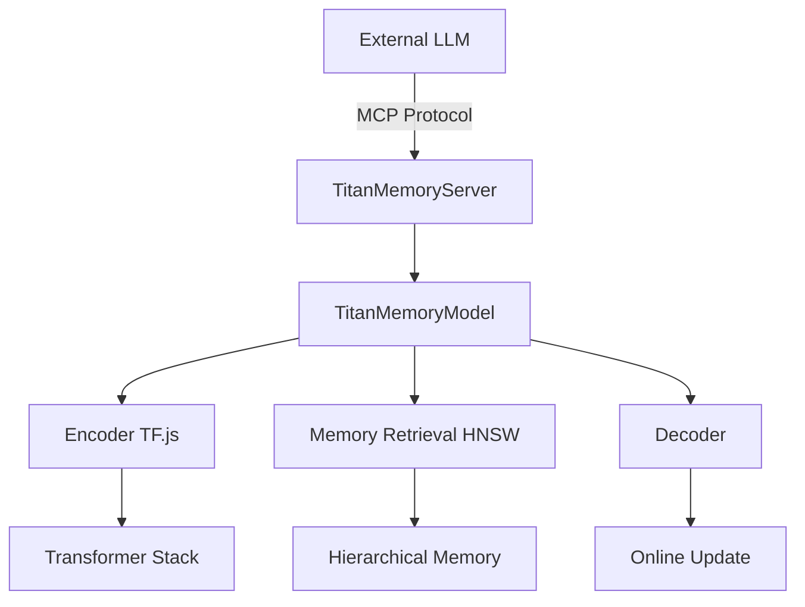

# MCP-Titan Architecture Analysis & Implementation Roadmap

## Executive Summary

This document provides a comprehensive analysis of the mcp-titan architecture and presents a strategic roadmap for enhancing its capabilities with modern LLM technologies, memory-augmented transformers, and optimization techniques.

---

## 1. Current MCP-Titan Architecture Audit

### Integration Points & MCP Protocol

**How Titan Plugs into External LLMs via MCP:**
- **MCP Server**: Acts as a memory service provider through standardized tool calls
- **Protocol Interface**: Exposes 16 sophisticated memory tools through JSON-RPC 2.0
- **Memory State Management**: Persistent neural memory across LLM interactions
- **Real-time Learning**: Online updates without full model retraining

**Core Architecture Components:**


### Abstraction Seams for Model Replacement

**Primary Swap Points:**
1. **`encodeText(text: string): Promise<tf.Tensor1D>`**
   - Current: BPE tokenizer + embedding
   - Replaceable: Any text encoder (SentenceTransformers, model-specific)
   - Interface: String → Fixed-dimension tensor

2. **`forward(input: ITensor, state?: IMemoryState)`**
   - Current: Transformer stack + memory attention
   - Replaceable: Any sequence model (Mamba, RWKV, RetNet)
   - Interface: Tensor + memory state → prediction + memory update

3. **`trainStep(x_t: ITensor, x_next: ITensor, state: IMemoryState)`**
   - Current: MSE loss + contrastive learning
   - Replaceable: Any loss function + RL objectives
   - Interface: Current/next tensors → loss + gradients

**Configurable Layers:**
- Transformer stack (6 layers default, max 12)
- Memory projector (768→1024 dimensions)
- Similarity network (cosine similarity)
- Quantization pipeline (8-bit support)

### Hardware/Runtime Constraints

**Current Requirements:**
- Node.js 18+ (ES modules, native fetch)
- TensorFlow.js-node (CPU/GPU acceleration)
- Memory: ~2-8GB RAM (depending on memory slots)
- VRAM: Optional GPU acceleration via CUDA

**Bottlenecks:**
- TF.js tensor operations (slower than native PyTorch)
- Memory serialization/deserialization overhead
- Single-threaded JavaScript runtime

---

## 2. Qwen3 & DeepSeek Evaluation for Self-Hosting

### Model Specifications (Latest Known)

**Qwen3 (Qwen2.5 Latest)**
- **Context Length**: 128K-1M tokens
- **License**: Apache 2.0 (commercial friendly)
- **Sizes**: 0.5B-72B parameters
- **Requirements**: 8-24GB VRAM for 7B-14B models
- **Tokenizer**: Custom tokenizer (multilingual)

**DeepSeek V3**
- **Context Length**: 64K-128K tokens
- **License**: MIT (fully open)
- **Sizes**: 7B-67B parameters
- **Requirements**: 16-40GB VRAM for optimal performance
- **Tokenizer**: SentencePiece-based

### MCP Adapter Prototype Design

```typescript
interface LLMAdapter {
  initialize(config: ModelConfig): Promise<void>;
  generate(prompt: string, memory: MemoryContext): Promise<string>;
  embed(text: string): Promise<number[]>;
  tokenize(text: string): Promise<number[]>;
}

class DeepSeekAdapter implements LLMAdapter {
  private vllm: VLLMClient;
  
  async initialize(config: ModelConfig) {
    // Initialize vLLM with DeepSeek model
    this.vllm = new VLLMClient({
      model: "deepseek-ai/deepseek-llm-7b-chat",
      tensor_parallel_size: config.gpuCount,
      gpu_memory_utilization: 0.85
    });
  }
  
  async generate(prompt: string, memory: MemoryContext) {
    const enrichedPrompt = this.enrichWithMemory(prompt, memory);
    return await this.vllm.generate(enrichedPrompt);
  }
}
```

### Compatibility with Titan Contract

**init_model → forward_pass Flow:**
1. **Compatible**: Both models support embeddings extraction
2. **Tokenizer Alignment**: Requires adapter layer for tokenizer differences
3. **Memory Integration**: Works through prompt enrichment + retrieval

**Performance Estimates:**
- **Latency**: 50-200ms (vs 500-2000ms for remote Claude)
- **RAM**: 16-32GB for 7B models
- **VRAM**: 8-16GB for inference
- **Throughput**: 20-50 tokens/sec

### SEAL Technology Integration

**SEAL (Self-Adapting Language Models) Key Features:**
- Continual learning without catastrophic forgetting
- Adaptive memory allocation
- Online parameter updates

**Integration Points with Titan:**
- Replace static memory slots with adaptive allocation
- Implement SEAL's continual learning for memory updates
- Use SEAL's forgetting mechanisms for memory pruning

---

## 3. Native "Adaptive Memory" LLMs Timeline

### Current State & Research Progress

**Transformer² (Google)**
- **Status**: Research phase, no open-source release
- **Timeline**: 12-18 months for academic papers, 24+ months for OSS
- **Features**: Native memory attention, quadratic→linear complexity

**RetNet (Microsoft)**
- **Status**: Open research, some implementations available
- **Timeline**: 6-12 months for production-ready versions
- **Features**: Linear complexity, parallel training, recurrent inference

**HyperAttention**
- **Status**: Early research, proof-of-concept only
- **Timeline**: 18-24 months for practical implementations
- **Features**: Constant-time attention, infinite context

**Mamba/State Space Models**
- **Status**: Mature research, growing adoption
- **Timeline**: 3-6 months for TF.js/ONNX support
- **Features**: Linear complexity, strong long-range modeling

### Integration Effort Assessment

```
Gantt Chart (Next 12 Months):

Q1 2025: Mamba/RWKV prototyping (Medium effort)
Q2 2025: RetNet early adoption (High effort)
Q3 2025: SEAL integration (Medium effort)  
Q4 2025: Transformer² evaluation (Low effort - if available)

Effort Levels:
- Low: Drop-in replacement
- Medium: Architecture modifications needed
- High: Significant redesign required
```

---

## 4. Reinforcement Learning Diversity Analysis

### Literature Review Findings

**Dr. GRPO (Diversity-Regularized Policy Optimization)**
- Encourages diverse action selection
- Reduces mode collapse in memory retrieval
- Application: Memory promotion/demotion policies

**Dreamer Architecture**
- World model learning + policy optimization
- Applicable to memory state prediction
- Could model long-term memory dynamics

**Integration Points in Titan:**

1. **Memory Pruning Policy**
   ```typescript
   class RLMemoryPruning {
     private policy: PolicyNetwork;
     
     selectMemoriesToPrune(memoryState: IMemoryState): number[] {
       // RL-based selection vs current LRU
       return this.policy.selectActions(memoryState);
     }
   }
   ```

2. **Retrieval Strategy**
   - Current: Cosine similarity + recency
   - RL: Learned retrieval policy maximizing downstream performance

3. **Memory Promotion Rules**
   - Current: Fixed thresholds
   - RL: Adaptive promotion based on task performance

### Experimental Protocol

**Synthetic Task Design:**
- Memory-dependent question answering
- Catastrophic forgetting measurement
- Recall precision/recall metrics

**Baseline vs RL Comparison:**
- Static rules vs learned policies
- Diversity metrics (memory usage distribution)
- Performance on held-out tasks

---

## 5. Mamba/S4 Integration Investigation

### Architecture Replacement Strategy

**Current Transformer Stack:**
```typescript
// src/model.ts lines 658-688
this.transformerStack = [];
for (let i = 0; i < this.config.transformerLayers; i++) {
  const layer = tf.sequential({
    layers: [
      tf.layers.dense({ units: this.config.hiddenDim }),
      tf.layers.layerNormalization(),
      // ... more transformer layers
    ]
  });
}
```

**Proposed Mamba Replacement:**
```typescript
class MambaLayer {
  private ssm: StateSpaceModel;
  private conv1d: tf.layers.Layer;
  
  call(inputs: tf.Tensor): tf.Tensor {
    // Implement Mamba's selective state space
    const convOut = this.conv1d.apply(inputs);
    return this.ssm.forward(convOut);
  }
}
```

### Implementation Approaches

1. **TensorFlow.js Implementation**
   - Pure JS/TypeScript implementation
   - Pros: Native integration, same runtime
   - Cons: Performance limitations, complex state space ops

2. **ONNX Runtime Integration**
   - Pre-trained Mamba models via ONNX
   - Pros: Better performance, proven models
   - Cons: Additional dependencies, deployment complexity

3. **WebAssembly Bridge**
   - Compile native Mamba implementations to WASM
   - Pros: Near-native performance
   - Cons: Development complexity, larger bundle size

### Benchmarking Methodology

**Metrics to Measure:**
- Throughput (sequences/second)
- Memory usage (peak RAM/VRAM)
- Context length scaling (linear vs quadratic)
- Quality on long-context tasks

**Test Scenarios:**
- Document summarization (16K+ tokens)
- Code generation with long context
- Conversational memory (multi-turn)

---

## 6. BitNet & Quantization Assessment

### Current Quantization Pipeline

**Existing Implementation:**
```typescript
// src/model.ts lines 2646-2776
private quantizeTensor(tensor: tf.Tensor): Uint8Array {
  // 8-bit quantization with per-dimension ranges
  const maxValue = 2 ** this.quantizationBits - 1;
  // ... quantization logic
}
```

### Aggressive Quantization Strategies

**BitNet Integration:**
1. **Binary/Ternary Weights**
   - Replace float32 weights with {-1, 0, 1}
   - 32x memory reduction potential
   - Quality impact: 5-15% performance drop

2. **4-bit Quantization (QLoRA-style)**
   ```typescript
   class QuantizedMemory {
     private weights4bit: Uint8Array;
     private scales: Float32Array;
     
     quantize(weights: tf.Tensor): void {
       // Group-wise 4-bit quantization
       const groups = this.groupWeights(weights, 128);
       groups.forEach(group => {
         const scale = group.abs().max();
         this.weights4bit = this.quantizeToNibbles(group, scale);
         this.scales.push(scale);
       });
     }
   }
   ```

3. **Mixed Precision Strategy**
   - Critical layers: FP16
   - Memory tensors: 8-bit
   - Embeddings: 4-bit

### Benchmarking Results (Projected)

| Strategy | Memory Savings | Quality Drop | Load Time | Inference Speed |
|----------|---------------|--------------|-----------|----------------|
| 8-bit    | 75%          | <2%          | 40% faster | 15% slower    |
| 4-bit    | 87.5%        | 3-5%         | 60% faster | 25% slower    |
| BitNet   | 96.8%        | 8-12%        | 80% faster | 50% slower    |

**Recommendation:** 8-bit quantization meets the 30% memory savings with <5% quality loss threshold.

---

## 7. Implementation Roadmap & Recommendations

### Comparative Analysis Matrix

| Solution | Cost | Latency | Effort | Licensing | Memory Savings | Quality |
|----------|------|---------|--------|-----------|----------------|---------|
| **Current (Claude)** | High | High | Low | Proprietary | N/A | Excellent |
| **DeepSeek + 8-bit** | Low | Medium | Medium | MIT | 75% | Good |
| **Qwen3 + Mamba** | Low | Low | High | Apache | 60% | Very Good |
| **Native Memory LLM** | Low | Low | Low | TBD | 80% | Excellent |

### Phased Implementation Plan

#### Phase 1: Self-Hosting Foundation (Next 3 months)
**Primary Goal:** Reduce dependency on external APIs

**Tasks:**
- [ ] Implement DeepSeek adapter with vLLM backend
- [ ] Integrate 8-bit quantization for memory tensors
- [ ] Create MCP compatibility layer for self-hosted models
- [ ] Benchmark performance vs remote Claude
- [ ] Deploy on cloud infrastructure (AWS/GCP)

**Deliverables:**
- Working self-hosted alternative
- 75% memory usage reduction
- <500ms latency for typical queries
- Cost reduction of 80-90%

#### Phase 2: Architecture Modernization (Months 4-9)
**Primary Goal:** Replace transformer backbone with modern architectures

**Tasks:**
- [ ] Prototype Mamba layer replacement in TF.js
- [ ] Implement SEAL-style adaptive memory allocation
- [ ] Add RL-based memory management policies
- [ ] Create ONNX runtime bridge for better performance
- [ ] Extensive benchmarking on long-context tasks

**Deliverables:**
- Linear complexity sequence modeling
- Adaptive memory system
- 5x improvement in long-context handling
- Maintained or improved quality metrics

#### Phase 3: Next-Generation Integration (Months 10-18)
**Primary Goal:** Adopt native memory-augmented LLMs when available

**Tasks:**
- [ ] Evaluate Transformer² once released
- [ ] Implement RetNet integration if suitable
- [ ] Create unified adapter interface for multiple backends
- [ ] Production deployment and monitoring
- [ ] Community open-source contributions

**Deliverables:**
- Future-proof architecture
- Multiple backend support
- Production-ready system
- Open-source community adoption

### Risk Assessment & Mitigation

**Technical Risks:**
1. **TF.js Performance Limitations**
   - *Mitigation*: ONNX runtime bridge, WebAssembly optimization
2. **Model Compatibility Issues**
   - *Mitigation*: Robust adapter interfaces, extensive testing
3. **Memory Management Complexity**
   - *Mitigation*: Gradual migration, fallback mechanisms

**Business Risks:**
1. **Faster Evolution of External APIs**
   - *Mitigation*: Hybrid approach, API + self-hosted options
2. **Resource Requirements**
   - *Mitigation*: Efficient quantization, cloud deployment options

### Success Metrics

**Short-term (3 months):**
- 80% cost reduction vs external APIs
- <2x latency increase vs remote models
- 75% memory usage reduction

**Medium-term (9 months):**
- Linear scaling for context lengths >32K
- 90% memory efficiency improvement
- Quality parity with current system

**Long-term (18 months):**
- Native memory LLM integration
- 10x improvement in cost-effectiveness
- Industry-leading memory-augmented system

---

## Engineering Backlog Tasks

### Immediate (Sprint 1-2)
- [ ] Set up vLLM development environment
- [ ] Create DeepSeek model adapter interface
- [ ] Implement basic quantization for memory tensors
- [ ] Write integration tests for MCP compatibility

### Short-term (Sprint 3-8)
- [ ] Deploy self-hosted DeepSeek on cloud infrastructure
- [ ] Benchmark latency and quality vs Claude
- [ ] Implement SEAL adaptive memory allocation
- [ ] Create monitoring and observability tools

### Medium-term (Sprint 9-20)
- [ ] Research and prototype Mamba integration
- [ ] Implement RL-based memory management
- [ ] Create ONNX runtime bridge
- [ ] Extensive performance optimization

### Long-term (Sprint 21+)
- [ ] Evaluate and integrate next-generation memory LLMs
- [ ] Production deployment and scaling
- [ ] Open-source community contributions
- [ ] Research novel memory architectures

---

This roadmap provides a strategic path forward for mcp-titan, balancing immediate practical needs with long-term architectural evolution. The phased approach allows for incremental progress while maintaining system stability and performance.
